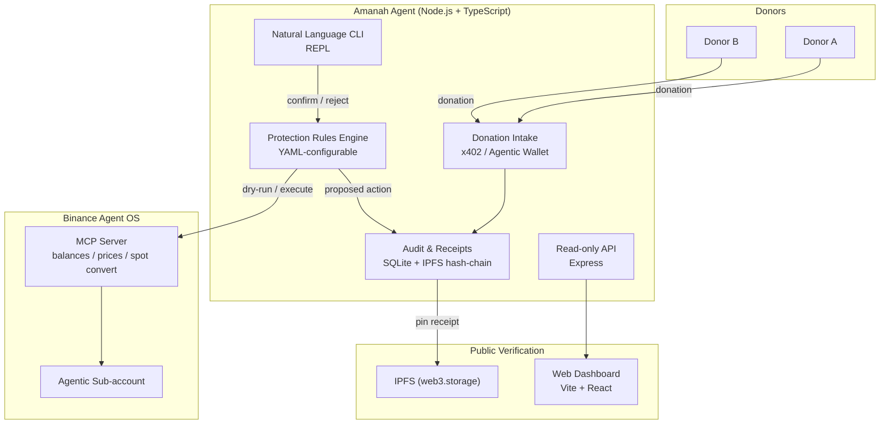

# Amanah — Autonomous Treasury Agent for Charities & NGOs

[](https://github.com/HusseinAdeiza/amanah/actions/workflows/ci.yml)

> **Track A submission — Binance Agent OS Mini Hackathon**  
> Deadline: Sept 8, 2026, 23:59 UTC

> **Track A submission — Binance Agent OS Mini Hackathon**  
> Deadline: Sept 8, 2026, 23:59 UTC

## Problem

Charities and NGOs in emerging markets increasingly receive crypto donations, but face three critical failures:

1. **Volatility erosion** — BNB, BTC, ETH can drop sharply between receipt and program spend, quietly shrinking budgets.
2. **Zero treasury staff** — small NGOs have no finance team to monitor markets or execute conversions manually.
3. **Donor distrust** — donors demand audit-grade transparency, but NGOs produce manual, error-prone reports.

## Solution

**Amanah** (Arabic for "trust / custody") is an AI agent that acts as an autonomous, auditable treasury guardian for charitable funds. It **receives** donations, **protects** their value, and **proves** every movement on an immutable public trail.

- Never trades speculatively — only applies pre-approved, rule-based protection.
- Human always confirms any action that moves funds (**confirm-before-execute**).
- Every event is hash-chained and pinned to IPFS for independent verification.

## Architecture



## Agent OS Feature Usage

| Feature | Where Used | Purpose |
|---------|-----------|---------|
| **MCP Server** | `agent/src/mcp/binance.ts` | Read balances, market prices, execute spot converts |
| **Agentic Wallet / x402** | `agent/src/intake/` | Generate donation payment links and receive funds |
| **Confirm-before-execute** | `agent/src/rules/index.ts` | Rules output **proposals**, human must confirm before convert executes |
| **Sub-account scopes** | Security model | Least-privilege: market read, account read, spot convert only |

## Project Structure

```
amanah/
├── agent/              # Core agent (Node.js + TypeScript)
│   ├── src/
│   │   ├── intake/     # Donation intake
│   │   ├── rules/      # Protection rules engine
│   │   ├── audit/      # Audit trail + IPFS receipts
│   │   ├── cli/        # Natural language REPL
│   │   ├── mcp/        # MCP client (Binance + mock)
│   │   ├── lib/        # Config, logger, DB
│   │   ├── api.ts      # Express API for dashboard
│   │   ├── index.ts    # Agent entry point
│   │   └── demo.ts     # End-to-end demo script
│   ├── rules.yaml      # Default protection rules
│   └── .env.example
├── web/                # Public dashboard (Vite + React)
│   ├── src/
│   │   ├── App.tsx
│   │   └── hooks/useApi.ts
│   ├── index.html
│   └── vite.config.ts
├── receipts/           # Shared IPFS receipt library
│   └── src/
│       ├── index.ts    # Receipt creation + hash chain
│       └── ipfs.ts     # IPFS clients (web3.storage + mock)
├── package.json        # Root pnpm workspace
└── README.md
```

## Security Model

- **Least-privilege sub-account**: Agent operates ONLY inside a Binance Agentic sub-account with scopes limited to: `market data read`, `account read`, `spot convert`. **NO withdrawal scope. NO futures.**
- **Keys via `.env`**: All secrets in `.env` (never committed). See `agent/.env.example`.
- **Dry-run by default**: `DRY_RUN=true` simulates the entire pipeline with mock balances and mock market data. Real execution requires `DRY_RUN=false` **plus** explicit per-action human confirmation.
- **Emergency stop**: Halt all proposals and revoke agent session via single command (documented in CLI as `exit` + env revocation).
- **Hash-chained receipts**: Every event is SHA-256 hashed with previous receipt reference, pinned to IPFS. Anyone can independently verify chain integrity.

## Setup

Requirements: Node.js >= 20, pnpm >= 9

```bash
# 1. Clone and install
pnpm install

# 2. Configure environment
cp agent/.env.example agent/.env
# Edit agent/.env — leave DRY_RUN=true for safe demo

# 3. Build all packages
pnpm run build

# 4. Start agent API + dashboard
pnpm run dev
# Agent API: http://localhost:4000
# Dashboard: http://localhost:5173

# 5. Run the end-to-end demo
pnpm run demo
```

## Demo Script (`pnpm run demo`)

The demo runs a fully scripted dry-run:

1. Shows initial mock treasury (USDC, BNB, BTC, ETH)
2. Simulates 3 incoming donations
3. Evaluates protection rules (triggers on volatile drop)
4. Creates a pending proposal
5. Human operator confirms the proposal (dry-run execution)
6. Verifies the audit hash-chain locally
7. Displays IPFS receipt links

Zero real funds. Zero API keys. Judges can run it within 60 seconds of clone.

## CLI Commands

```bash
pnpm --filter agent run cli
```

Available commands in REPL:
- `balance` — current balances
- `value` — total treasury value in USD
- `donate <asset> <amount>` — simulate a donation
- `rules` — evaluate protection rules
- `proposals` — list pending proposals
- `confirm <id>` — confirm a proposal
- `reject <id> [reason]` — reject a proposal
- `audit` — show full audit trail
- `verify` — verify local + remote receipt chain
- `summary` — treasury summary

## Roadmap

- [ ] On-chain attestation of receipt CIDs (Binance Smart Chain)
- [ ] Multi-sig confirmation for large conversions
- [ ] Programmatic disbursement workflows with milestone checks
- [ ] Integration with Binance Pay for fiat off-ramp
- [ ] NLP-powered donor reporting via LLM + audit trail

## License

MIT — built for the Binance Agent OS Mini Hackathon.
